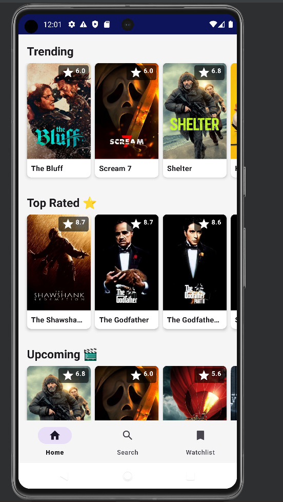
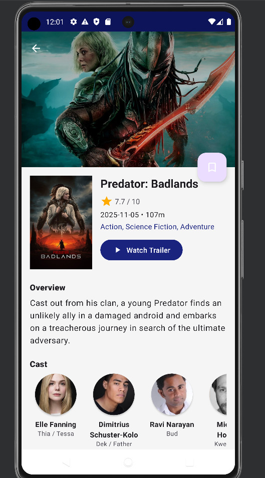
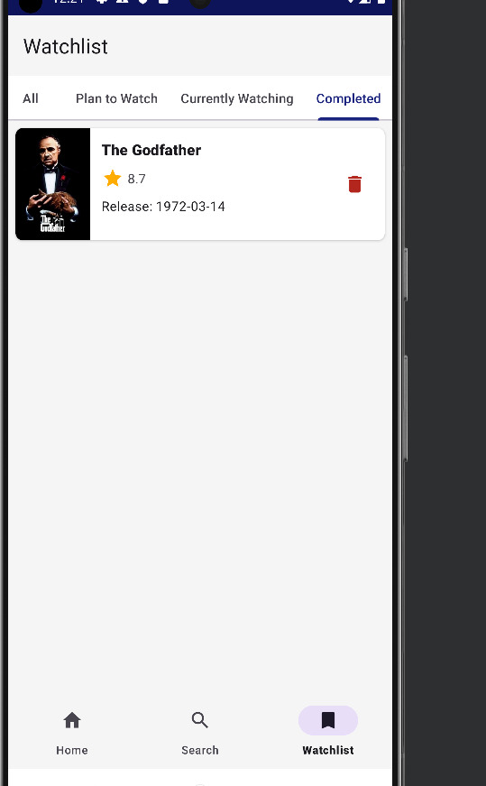

# MediaVault 🎬

MediaVault is a comprehensive Android application that allows users to discover, search, and track their favorite movies and TV shows. It leverages the TMDB (The Movie Database) API to fetch real-time data and provides offline capabilities for managing a personalized watchlist.


## Features

* **Trending Discovery**: Browse trending and popular movies/TV shows right from the home screen.
* **Smart Search**: Search for specific titles with an optimized debounce implementation to reduce unnecessary API calls and improve performance.
* **Detailed Information**: View comprehensive details including synopsis, cast members, ratings, genres, and watch trailers.
* **Personal Watchlist**: Save items to a local watchlist for offline viewing. The watchlist includes category filtering capabilities.
* **Background Sync & Notifications**: Occasionally syncs data in the background and sets up push notifications via WorkManager.

---

## Screenshots

<p align="center">
  
  
  
</p>

---

## Architecture & Tech Stack

This project follows the **MVVM (Model-View-ViewModel)** architectural pattern, ensuring a clean separation of concerns, easier maintenance, and robust, testable code.

### Core Technologies
* **Language**: Java
* **UI toolkit**: XML Layouts with ViewBinding integration
* **Minimum SDK**: 26 (Android 8.0 Oreo)

### Architecture Components
* **ViewModel & LiveData**: ViewModels manage UI-related data in a lifecycle-conscious way. LiveData allows the UI to react to state changes automatically without memory leaks.
* **Navigation Component**: A single-activity architecture where `MainActivity` hosts a `NavHostFragment`. It handles all navigation flows and fragment transactions between the Home, Search, and Watchlist screens.
* **Room Database**: Provides a robust local SQLite database layer for offline watchlist storage.
* **WorkManager**: Schedules and executes background operations (like pushing update notifications) resiliently.

### Networking & Asynchronous Operations
* **Retrofit**: Type-safe HTTP client used to interface with the external TMDB REST API.
* **Gson**: Converts JSON string responses from the API into structured Java Objects (`data/model/*`).
* **RxJava 3**: Used extensively for composing asynchronous and event-based networking calls, as well as database queries without blocking the main UI thread.

### Image Loading
* **Glide**: Fast and highly efficient open-source media management and image loading framework, used to load movie posters and cast headshots seamlessly into `ImageViews`.

---

## Project Directory Structure

The codebase is organized by feature and architectural layer to keep responsibilities distinct:

### 1. `ui` (Presentation Layer)
Contains all user-facing Android components: Activities, Fragments, and RecyclerView Adapters.
* **`HomeFragment`**, **`SearchFragment`**, **`WatchlistFragment`**: The three primary destinations managed by the Bottom Navigation view.
* **`DetailActivity`**: The detailed view launched when a user clicks a movie.
* **`adapter`**: Contains `RecyclerView.Adapter` classes that bind the list data to the view layouts elements.

### 2. `ui/viewmodel` (State Management)
Acts as the communication center between the Data Layer and the UI Layer.
* `HomeViewModel`, `SearchViewModel`, `DetailViewModel`, `WatchlistViewModel`.
* They execute network requests (via RxJava) or read from the Room Database, and post the results to `LiveData` for the Fragments to observe.

### 3. `data` (Data Layer)
Handles all data flow. This layer abstracts the data sources (Network vs. Local) from the rest of the application.
* **`network`**: Contains the Retrofit `ApiClient` and `ApiService` interfaces defining the API endpoints (e.g., getting trending movies, searching).
* **`local`**: Contains the Room Database setup (`MovieDatabase`), Data Access Objects (`MovieDao`), and Entities (`MovieEntity`).
* **`model`**: The domain POJOs (Plain Old Java Objects) defining the structure of Media, CastMembers, Genres, and API Responses.

### 4. `worker` (Background Services)
* **`NotificationHelper`**: Utility to build and trigger local push notifications to alert the user about watchlist reminders or newly trending movies.

---

## Setup & Running Locally

1. **Clone the Repository:**
   ```bash
   git clone <repository_url>
   ```
2. **Open in Android Studio:**
   Launch Android Studio, select `File > Open`, and navigate to the cloned `MediaVault` / `MoviesLAb` directory.
3. **API Key Setup** *(Required)*:
   Ensure you have a TMDB v3 API Key. You may need to inject it into `ApiClient` or configure it via the `local.properties` file using Build Config fields, according to your team's specification.
4. **Build and Run:**
   Wait for Gradle to sync dependencies. Select an Emulator or connected Physical Device and click the **Run** button (`Shift + F10`).

---

## Contribution Workflow

Because this is a multi-developer project, work is divided across feature files. To prevent merge conflicts:

1. Always branch off main: `git checkout -b feature/your-feature-name`.
2. Ensure you are only editing the specific files assigned to your feature suite (e.g., *Person 3 edits Home files, Person 6 edits Room DB files*).
3. Stage and commit your code cleanly: `git commit -m "Implement Home Screen UI"`.
4. Push your branch to GitHub and create a **Pull Request** for the team to merge.

